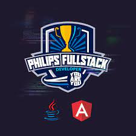

  

# Developing Your Own Personal Web Page
## Presentation
This project is part of the bootcamp ["Philips Fullstack Developer | You Are You"](https://web.dio.me/home). The main objective is apply the concepts of HTML 5, CSS and Bootstrap building a personal website.

## Tecnologies And Tools
HTML - CSS3 - BOOTSTRAP - VS Code
## Stages
To acompish this stage one should develop the practices proposed. They are growth in complexity as far new concepts are learned along the classes. They are briefly described below for reference:

|Stage    |Description                                                              |
|------------|-------------------------------------------------------------------------|
|Stage 1|Index page: write the code of a basic page called index.html having at least the following elements: doctype, html, head, meta defining charset = UTF-8 , title and body tags. Enjoy the job! Publish your own name writing it on the the body element.|
|Stage 2|What it means? Semantics is a relevant function of the section, header, article, aside, footer and h1 to h6 tags. In this part they will be used to give som structure to the index page.|
|Stage 3|Get an anchor to navigate: in deed the most famous feature web pages have is their linking behavior, the capacity to jump into another content by a simple click. Let's use it too!|
|Stage 4|Imagine a world made by words only! It is not so fun, doesen't it? Let's include some images on our index page.|
|Stage 5|Listing stuffs: some people are addicted to lists. They do lists of lists of items. Thinking on them, HTML has the list tag that has two tipes, ordered and unordered lists.|
|Stage 6|Identity and class? We have it! What could be better than put your personal web page aligned with your style and identity? CSS concepts will help you to reveal your style and design preferences.|
|Stage 7|Elegance: The content is important however the format is also an important thing. Use all font you need to make your message better understood.|
|Stage 8|As said, we love lists! More than order the stuffs, lists make the items more atractive helping us to follow their acomplishment. Use the HTML features to give more style to your lists. There are lots of them!|
|Stage x|Formalizing: It seems that the task is becaming more formal. Let's so to include a form element in the index page.|
