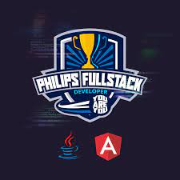

  
   
   

# Presentation
This repository is part of the bootcamp ["Philips Fullstack Developer | You Are You"](https://web.dio.me/home). The projects and activities developed along this course will be available here. You are invited to use the codes and improve them. It will be great if you have comments or suggestions to make them better. 

## Tecnologies And Tools
GIT - HTML - CSS3 - BOOTSTRAP - FLEXBOX - JAVA SCRIPT - MY SQL - JAVA - ANGULAR - SPRING - POSTMAN - VS Code - INTELLIJ
## List of Folders
The master branch has the functional version of the projects. They are segregated in folders briefly described below for reference:

| Folder | Description                                                              |
| -------- | ------------------------------------------------------------------------ |
| devweek | Breast Cancer Projetct: here we have the backend part of the project. It is an api with breast cancer statistcs related to Brazil occurrences. The application used Spring Framework, the code was writen in Java and the DBMS is MySQL. |
| angularDevWeek | Breast Cancer Projetct: the api is consumed by an http application developed in Angular. |
| MyWebSite | Personal Web Site Project:  this project applied the concepts presented by the course of HTML and CSS basics.|
| project-flexbox-dio | Flex Turismo Web Page Project: the concepts of flexbox model to develop the design of a tour agency.|
| JavaScriptBasics | JS Syntax: in this folder there are the lessons of the Java Script basic syntax. |
| javaScriptSyntaxAndOperators | JS Syntax: this lesson proposed some practice focused on the several operators available in Java Script Language. | 
| javaScriptTypesAndVariables | JS Syntax: this lesson proposed some practice focused on constants, variables and types available in Java Script Language. There are practical activities proposed to put in movement the concepts learned along the course.|
| javaScriptModules |JS Syntax: here we will learn and practice about modules, their concepts and how use them.|
| javaScriptFunctions | JS Syntax: In this course functions will be covered in more detail: types of funtions, parameters, loops, the reserved word "this" and arrow functions. Off-course it will be finished with a proposed practice. |
| javaScriptCollections |JS Syntax: hey, no one lives alone, doesn't it? Collections are a powerful feature that gives you super powers to manage your data. Let's go together to learn about Map, Set and Structure.|
| javaScriptDebugging | JS Syntax: Mistakes happens, it is not a shame if you correct it and move on. In our code it would not be different. Let's exercise the techinics to find and fix the issues to make our code run smoothly. |
| javaScriptOOJS | JS Syntax: now it will be less abstract, more touchable (really?). We will talk about the Oriented Object Paradigm applyed to JAva Script. |
| javaScriptAsynchronous | JS Syntax: all thing have it own pace, Let's learn how to implement this concept in Java Script.|
| javaScriptIncialChalenges | Dev, we have a problem: now it is time to put in practice the theory. Just have fun and move on!|
| typeScriptIntroduction | Type Script Introduction: it allways time to learn another new coding language. Ok, it is not exactly a new language however it will help you to control better your code reducing lines of code. Enjoy it!|
| angularComponentsArchiteture | Front-End Components: here we will start to talk about the power of the components' architeture. They are the core concept of Angular Framework. It is a way to reduce the complexity by a better management. It is also a way to reuse code and scale up applications. Much to learn we have. Let's start right now!|