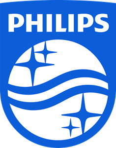
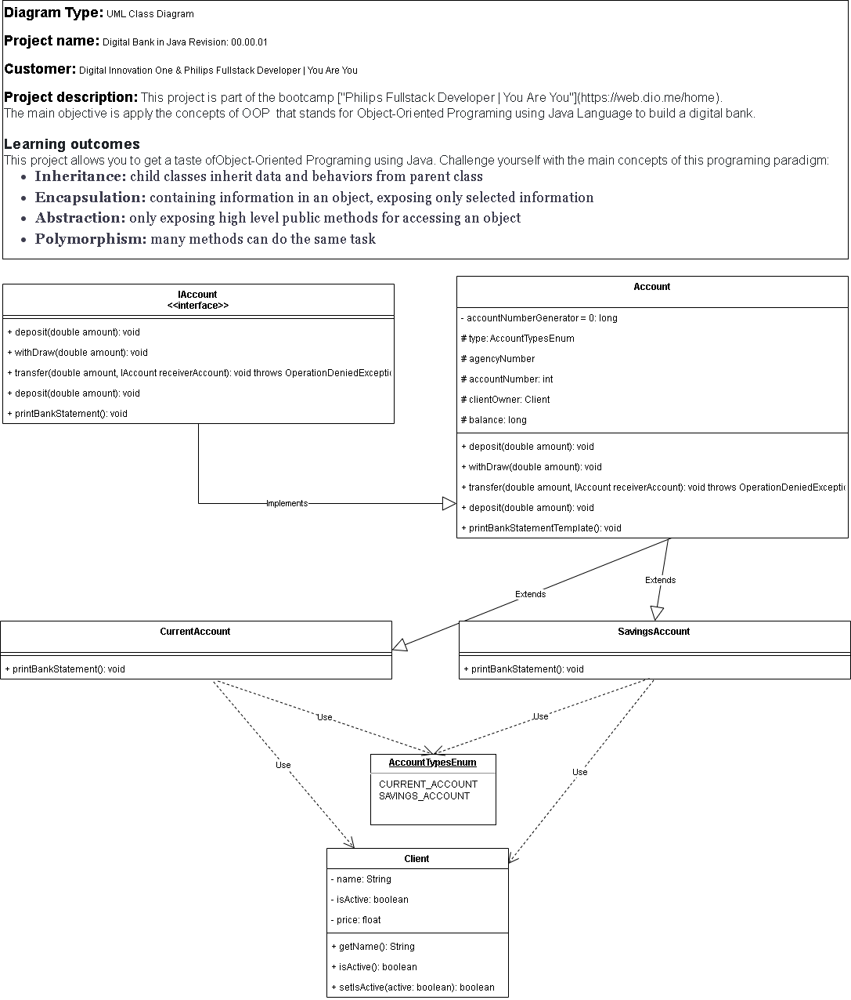

  
   
       

# Digital Bank Abstraction
## Presentation
This project is part of the bootcamp ["Philips Fullstack Developer | You Are You"](https://web.dio.me/home). 
The main objective is apply the concepts of OOP  that stands for Object-Oriented Programing using Java Language to build a digital bank.

## Tecnologies And Tools</h2>

            
            
            
            

## Description
This project allows you to get a taste ofObject-Oriented Programing using Java. 
Challenge yourself with the main concepts of this programing paradigm:
- Inheritance: child classes inherit data and behaviors from parent class
- Encapsulation: containing information in an object, exposing only selected information
- Abstraction: only exposing high level public methods for accessing an object
- Polymorphism: many methods can do the same task
## UML Class Diagram
To better image quality, the file ./UML/digitalBank.drawio may be opened on https://app.diagrams.net/.

    

## Usage Instructions
- Create a blank Java Project named as com.dio.digitalBank.
- Copy and paste this repository's content into your project folder.

